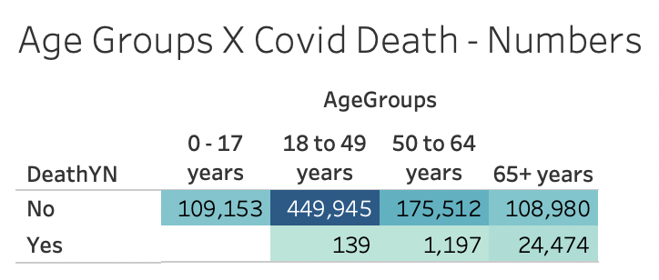
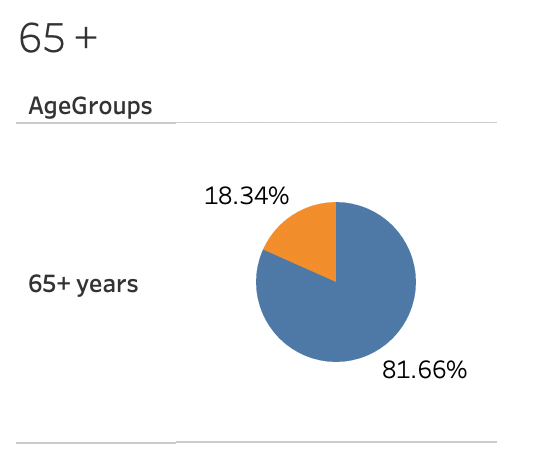
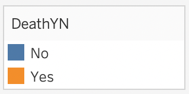

  

 
  

## The Purpose of this Analysis
Over the past year and a half the Covid-19 pandemic had touched a lot of lives and changed the way we in the world lives day by day. One of the big issues with Covid-19 was the mis-information being spread. One of the pieces of mis-information was how the virus affected the population according to age. We were told that the young weren’t susceptible to the illness and how the elderly were at the greatest risk for Covid-19. Now after more than a year we have more data that we can analysis.
  For this group project we choose to analysis the Covid-19 data, since there is so much available and easily assessable. Taking our data right from the CDC website. Cleaning and analyzing all the data available and simplifying down to age (all other options had too many variables) we want to answer: 
#### Based on age, How likely are you to survive Covid-19 ?  
  
 

Data Analyst Team:  Luis Acevedo Jr., David Lago, Susanna Correia, Zarneisha Browning, Maurice Beckford

## Tableau Data

 

* After getting the data visualization from Tableau, the group has decided to drop the data for age groups under 65 since there were almost no deaths to that groups. We have also decided to add more features to the dataset.
 
## Machine Learning Model

* A Neural network model using sk-learn and TensorFlow is used to explore the dataset.

 
## Database

* A Postgres database using AWS's relational database service (RDS) is being used for the database and connected using PgAdmin. A csv file with all the raw data will be stored in a S3 bucket on AWS.

## New Tableau Data

https://public.tableau.com/app/profile/susana.correia/viz/FloridaCovidData/Story1?publish=yes
