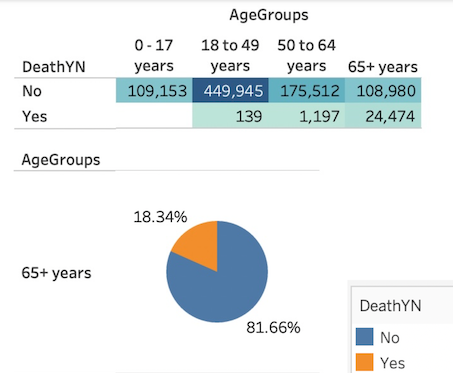
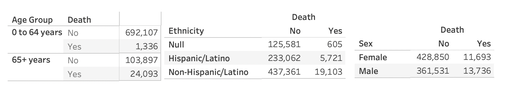
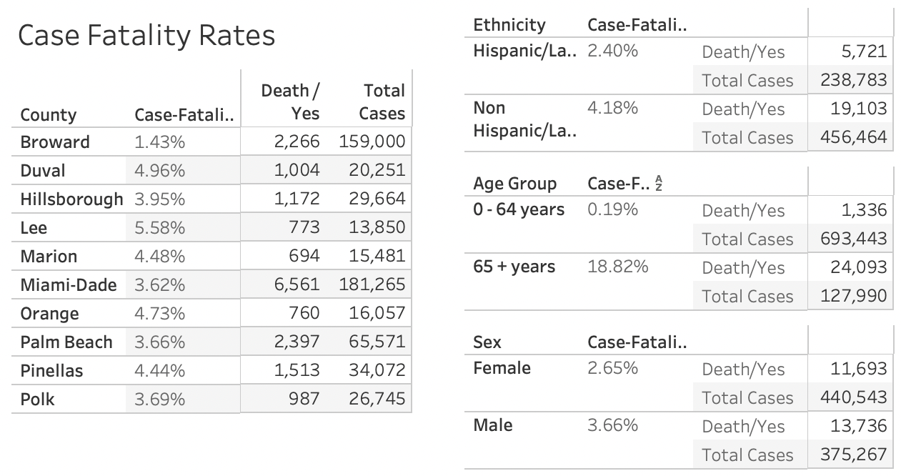

[//]:<>
[//]:<>
 
 

## The Purpose of this Analysis
Over the past year and a half the Covid-19 pandemic had touched a lot of lives and changed the way we in the world lives day by day. One of the big issues with Covid-19 was the mis-information being spread. One of the pieces of mis-information was how the virus affected the population according to age. We were told that the young weren’t susceptible to the illness and how the elderly were at the greatest risk for Covid-19. Now after more than a year we have more data that we can analysis.

For this group project we choose to analysis the Covid-19 data, since there is so much available and easily assessable. Taking our data right from the CDC website, then cleaning and analyzing all the data available, the overall question we want to answer: 
  
#### What attributes are most likely to contribute to covid-19 deaths??  
  
 

Data Analyst Team:  Luis Acevedo Jr., David Lago, Susanna Correia, Zarneisha Browning, Maurice Beckford

## Tableau Data

* After getting the data visualization from Tableau, the group has decided to drop the data for age groups under 65 since there were almost no deaths to that groups. We have also decided to add more features to the dataset.
 
## Machine Learning Model

* A Neural network model using sk-learn and TensorFlow is used to explore the dataset.

 
## Database

* A Postgres database using AWS's relational database service (RDS) is being used for the database and connected using PgAdmin. A csv file with all the raw data will be stored in a S3 bucket on AWS.

## New Tableau Data

* After spliting the age group to 0 to 64 and 65 +, the group has decided to add more variables to the model: County, Sex and Ethnicity.

The following is the link to Tableau Stories:

https://public.tableau.com/app/profile/susana.correia/viz/FloridaCovidData/Story1?publish=yes

* We have found that when we talk about Covid-19 related data, one of the terms we see is Case Fatality Rate, or CFR. CFR helped us understand how many of those with a confirmed diagnosis of COVID-19 die as a result of the disease.
* Case Fatality Rate is calculated dividing the total number of deaths by the total number of Covid cases. For our project we have decided to analyze the probability of death in relation to sex, ethnicity, county and age group. So we have tried to identify potential risk factor for death using those different variables.

https://public.tableau.com/app/profile/susana.correia/viz/CaseFatalityRates_Covid_FL/CaseFatalityRates?publish=yes

## Conclusion

When we look at deaths and counties we see that there is no association between counties and mortality. The same happens with sex and ethnicity. No social or environmental assossiation with deaths. However it is different when we talk about Age Groups. We see significant difference between the two groups. After all, current data suggests that elderly are most at risk. Data shows a very large difference of the CFR by age. For COVID-19 cases we see that the elderly are at the greatest risk of dying, if infected with the virus. It is important to say that  the CFR (Case Mortality Rate) simply represents the number of deaths divided by the number of confirmed cases. It does not tell us the true risk of death, which is much harder to estimate. The CFR changes over time.

